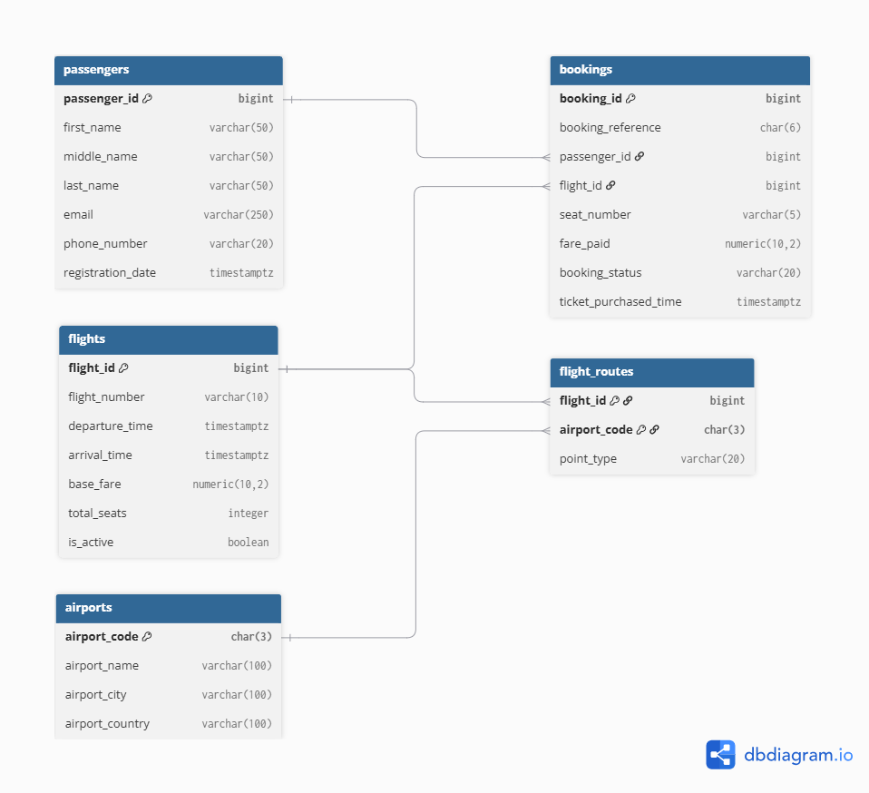

EX603 Data and Algorithms for Scalable Systems  
Name: Shin Eui Lee  

# Project Title: Airline Booking and Operation Sytem
A relational database managing airline operation including managing flights, passenger reservations and routes. 

## Theme: Airline Booking

  - actor: passangers
  - producer: flights
  - event: bookings
  - catalog: airports
  - junction: flight_routes
  - metric: fare_paid

What the system does: A relational database for a large-scale application for airline booking

## Domain Overview

This platform is an airline booking system where passengers can sign up, search for flights, book seats, and manage their reservations. Behind the scenes, it helps the airline organize its daily operations by scheduling flight times, connecting flights to departure and arrival airports, and preventing planes from being overbooked. The system keeps all of this information in one place so the company always knows who is flying and how much they paid.

To support everyday operations, the database answers several key questions. For flight tracking, it shows which flights are arriving at or departing from a specific airport and their scheduled times. For customer and revenue management, it helps staff quickly see who is booked on each flight, how many open seats remain, and how much money each flight has generated from ticket sales.

## Entity Relationship Diagram (ERD)

### ERD Image

### ERD diagram source

// Actor: passengers
Table passengers {
  passenger_id bigint [primary key]
  first_name varchar(50)
  middle_name varchar(50)
  last_name varchar(50)
  email varchar(250)
  phone_number varchar(20)
  registration_date timestamptz
}

// Producer: flights
Table flights {
  flight_id bigint [primary key]
  flight_number varchar(10)
  departure_time timestamptz
  arrival_time timestamptz
  base_fare numeric(10,2)
  total_seats integer
  is_active boolean
}

// Event: bookings
Table bookings {
  booking_id bigint [primary key]
  booking_reference char(6)
  passenger_id bigint
  flight_id bigint
  seat_number varchar(5)
  fare_paid numeric(10,2)
  booking_status varchar(20)
  ticket_purchased_time timestamptz
}

// Catalog: airports
Table airports {
  airport_code char(3) [primary key]
  airport_name varchar(100)
  airport_city varchar(100)
  airport_country varchar(100)
}

// Junction: flight_routes
Table flight_routes {
  flight_id bigint
  airport_code char(3)
  point_type varchar(20)

  indexes {
    (flight_id, airport_code) [pk]
  }
}

// Relationships 
Ref: passengers.passenger_id < bookings.passenger_id
Ref: flights.flight_id < bookings.flight_id
Ref: flights.flight_id < flight_routes.flight_id
Ref: airports.airport_code < flight_routes.airport_code
